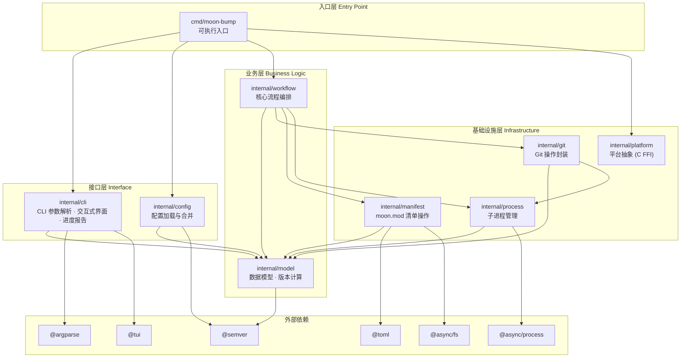

# 系统架构文档

## 1. 项目概述

`moon-bump` 是一款专为 [MoonBit](https://www.moonbitlang.com/) 生态打造的交互式版本发布工具。它深受 [bumpp](https://github.com/antfu/bumpp)（Node.js/TypeScript）启发，使用纯 MoonBit 重写，将同样优雅的 CLI 版本管理体验带入 MoonBit 生态。

**核心特性：**
- ⚡️ 纯 MoonBit 编写，编译为原生二进制
- 🎨 交互式版本选择，带 Conventional Commits 智能推导
- 🚀 Git 深度集成：自动提交、打标签、推送
- 📦 精确编辑 `moon.mod` 清单文件（TOML 格式）
- 🛠️ 全自动发布流水线，支持生命周期脚本

## 2. 技术选型

| 领域 | 选型 | 说明 |
|------|------|------|
| 语言 | MoonBit | native target，编译为平台原生二进制 |
| 异步模型 | `moonbitlang/async` | 用于子进程和文件 I/O |
| 版本解析 | `mizchi/semver` | SemVer 解析与版本号计算 |
| TOML 解析 | `mizchi/syntree/toml` | Tokenizer 级别精确编辑 moon.mod |
| TUI 交互 | `mizchi/tui` | 终端输入/输出 |
| 参数解析 | `moonbitlang/core/argparse` | CLI 参数解析 |
| 子进程 | `moonbitlang/async/process` | 执行 Git 命令和 shell 脚本 |
| 文件系统 | `moonbitlang/async/fs` | 文件读写和目录遍历 |

## 3. 整体架构图

## 4. 分层设计说明

### 入口层（Entry Point）

`cmd/moon-bump` 是唯一的可执行包，负责：
- Windows 平台 UTF-8 代码页设置（通过 C FFI 调用 `SetConsoleOutputCP(65001)`）
- 编排整个应用流程（解析 → 加载 → 检查 → 选择 → 计划 → 确认 → 执行）
- 顶层错误处理和退出码管理

### 接口层（Interface）

- **`internal/cli`**：用户交互界面，包括参数解析、交互式版本选择、发布确认和进度输出。使用 pre-build 步骤嵌入 `moon.mod` 获取应用版本号。
- **`internal/config`**：配置管理，负责加载 `bump.config.json`、与 CLI 参数合并、规范化为最终 `Options`。

### 业务层（Business Logic）

- **`internal/workflow`**：核心业务流程编排器，实现 inspect → build_plan → execute 三阶段管道。
- **`internal/model`**：纯数据模型层，定义所有类型、错误枚举、版本计算逻辑。不依赖任何 I/O。

### 基础设施层（Infrastructure）

- **`internal/manifest`**：`moon.mod` 文件操作，使用 TOML tokenizer 精确修改版本号字段，支持普通文本的边界感知替换。
- **`internal/git`**：Git 命令封装（status、log、add、commit、tag、push），包含 Conventional Commits 解析。
- **`internal/process`**：跨平台子进程执行（Windows 使用 `cmd /c`，Unix 使用 `sh -c`）。
- **`internal/platform`**：平台特定代码，目前仅有 Windows 代码页管理的 C FFI。

## 5. 与 bumpp 的架构对照

| bumpp (TypeScript) | moon-bump (MoonBit) | 差异说明 |
|---|---|---|
| `src/cli/parse-args.ts` + `cac` | `internal/cli/args.mbt` + `@argparse` | 不同的参数解析库 |
| `src/config.ts` + `unconfig` | `internal/config/config.mbt` + JSON 解析 | moon-bump 仅支持 JSON 配置 |
| `src/version-bump.ts` (主流程) | `internal/workflow/workflow.mbt` | 相同的 pipeline 模型 |
| `src/operation.ts` (OOP 状态管理) | `internal/model/types.mbt` (纯数据) | 函数式 vs 面向对象 |
| `package.json` / `deno.json` | `moon.mod` (TOML) | 不同的生态清单格式 |
| `jsonc-parser` JSON 编辑 | `@toml` tokenizer 精确编辑 | 清单格式差异 |
| `npm install` | `moon update` | 不同的依赖管理器 |
| `tinyexec` | `@async_process` | 不同的子进程库 |
| `prompts` (交互式) | `@tui` (交互式) | 不同的终端交互库 |
| `package.json scripts` | `moon.mod options(scripts: {...})` | 不同的生命周期脚本源 |

## 6. 关键设计决策

### inspect / plan / execute 三阶段分离

将发布流程分为三个明确的阶段：
1. **inspect** — 收集上下文（Git 状态、文件列表、当前版本、提交记录）
2. **build_plan** — 构建执行计划（文件编辑列表、提交消息、标签名称）
3. **execute** — 执行计划（写文件、Git 操作）

这种分离使得计划可以在执行前展示给用户确认。

### 纯数据模型

不使用 OOP 状态管理类（如 bumpp 的 `Operation`），所有状态通过 `struct` 在函数间传递。这符合 MoonBit 的函数式编程风格。

### Result 错误传播

所有可失败操作返回 `Result[T, AppError]`，使用 match + early return 模式一致地传播错误。

### Partial Failure 处理

执行阶段跟踪已完成步骤，失败时报告部分完成状态，帮助用户手动恢复。

### 进度回调

通过 `emit` 回调报告 `ProgressEvent`，解耦 UI 展示与业务逻辑。

---

> 📖 **更多信息**
> - 详细模块设计：[module-design.md](module-design.md)
> - 执行流程：[workflow.md](workflow.md)
> - 数据模型：[data-model.md](data-model.md)
> - 配置系统：[configuration.md](configuration.md)
