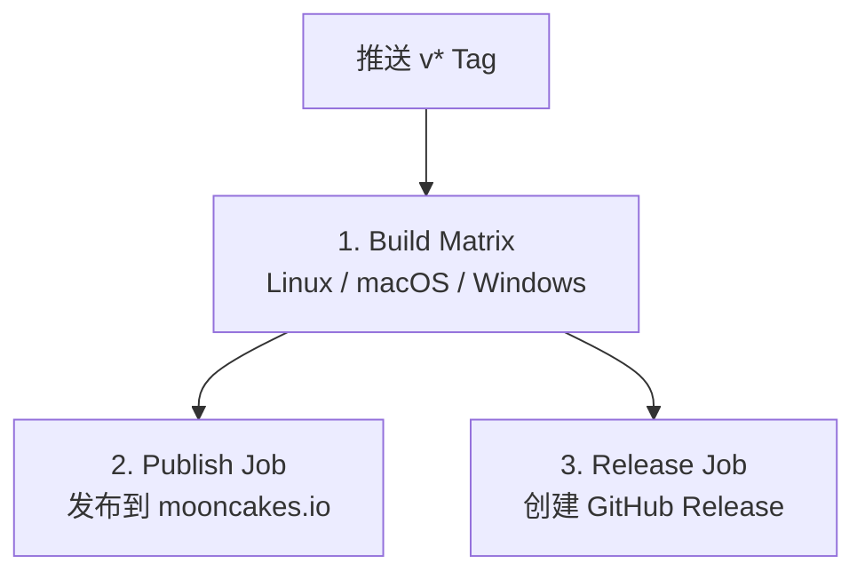
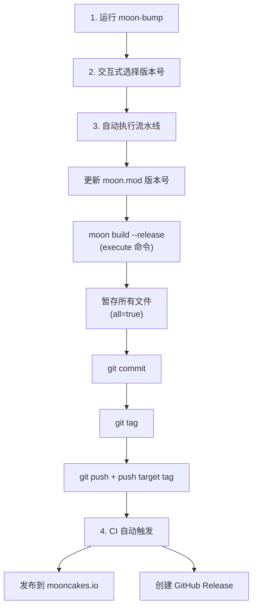

# 构建与发布文档

本文档描述 `moon-bump` 的开发环境搭建、构建流程、CI/CD 管道和发布流程。

## 1. 开发环境搭建

### 前置条件

- [MoonBit 工具链](https://docs.moonbitlang.com)（包含 `moon` 命令）
- Git

### 获取源码

```bash
git clone https://github.com/unmbt/moon-bump
cd moon-bump
```

### 安装依赖

```bash
moon update
```

## 2. 常用命令

| 命令 | 说明 |
|------|------|
| `moon update` | 更新依赖 |
| `moon check --target native` | 类型检查 |
| `moon check --target native --warn-list +73 --deny-warn` | 严格检查（CI 标准） |
| `moon build --target native` | Debug 构建 |
| `moon build --target native --release` | Release 构建 |
| `moon test --target native` | 运行测试 |
| `moon test --target native --update` | 运行测试并更新快照 |
| `moon info` | 更新 `.mbti` 接口文件 |
| `moon fmt` | 格式化代码 |
| `moon info && moon fmt` | 更新接口并格式化（推荐的最后步骤） |

## 3. 构建产物

| 构建模式 | 输出路径 |
|----------|----------|
| Debug | `_build/native/debug/build/cmd/moon-bump/moon-bump.exe` |
| Release | `_build/native/release/build/cmd/moon-bump/moon-bump.exe` |

- 目标平台：native（Windows、Linux、macOS）
- 二进制命名：`moon-bump`（Windows 上为 `moon-bump.exe`）
- Release 构建启用优化，生成更小更快的二进制

## 4. 项目结构说明

```
moon-bump/
├── moon.mod                  # 模块元数据（名称、版本、依赖）
├── bump.config.json          # 自身的版本发布配置
├── cmd/
│   └── moon-bump/            # 可执行入口包
│       ├── main.mbt          # main 函数
│       ├── main_wbtest.mbt   # main 内部白盒测试
│       └── moon.pkg          # 包配置
├── internal/                 # 内部包（不对外导出）
│   ├── model/                # 数据模型与版本计算
│   ├── cli/                  # CLI 参数解析与 TUI 交互界面
│   ├── config/               # 配置加载与合并
│   ├── workflow/             # 核心流程编排
│   ├── manifest/             # moon.mod 清单操作
│   ├── git/                  # Git 操作封装
│   ├── process/              # 子进程管理
│   └── platform/             # 平台抽象（C FFI）
├── bumpp/                    # 原始 bumpp 参考文档（SDD）
├── scripts/                  # 安装脚本
│   ├── install.sh            # Linux/macOS 安装
│   └── install.ps1           # Windows 安装
├── docs/                     # 技术文档
└── .github/workflows/        # CI/CD
    └── ci.yml                # 构建、发布与 Release 工作流
```

> **注意**：顶层 `core/`、`cli/`、`fs/`、`git/`、`sys/`、`config/` 目录为空（已废弃）。

## 5. CI/CD 流程

使用 GitHub Actions（`.github/workflows/ci.yml`）。

### 触发条件

| 事件 | 条件 | 效果 |
|------|------|------|
| Push | `master` 分支 | 运行 Build |
| Pull Request | 目标 `master` 分支 | 运行 Build |
| Push Tag | `v*` 匹配 | 运行 Build + Publish (mooncakes.io) + Release |

### 任务流概览



### 1. Build Job

三平台矩阵构建：

| 平台 | Runner | 产物名 |
|------|--------|--------|
| Linux | `ubuntu-latest` | `moon-bump-linux-amd64` |
| macOS | `macos-latest` | `moon-bump-macos-arm64` |
| Windows | `windows-latest` | `moon-bump-windows-amd64.exe` |

**构建步骤**：
1. Checkout 代码仓库
2. 配置 MoonBit 工具链 (`hustcer/setup-moonbit@v1`)
3. `moon update` 更新注册表与依赖
4. `moon test --target native` 运行全部测试
5. `moon check --target native --warn-list +73 --deny-warn` 严格类型检查
6. `moon build --target native --release` 编译 Release 二进制
7. 将编译产物复制并重命名为对应平台产物
8. 上传构建产物作为 GitHub Artifact（保留 7 天）

### 2. Publish Job (mooncakes.io)

仅在推送 `refs/tags/v*` 时运行：
1. 校验 Tag 版本号与 `moon.mod` 中版本号是否一致（`moon run cmd/moon-bump -- -V`）
2. 配置 Mooncakes 访问凭证（`${HOME}/.moon/credentials.json`）
3. 执行 `moon publish` 发布至官方包仓库 [mooncakes.io](https://mooncakes.io)

### 3. Release Job (GitHub Releases)

仅在推送 `refs/tags/v*` 时运行：
1. 下载三平台的构建 Artifact
2. 使用 `softprops/action-gh-release@v2` 创建 GitHub Release
3. 自动生成 Release Notes
4. 上传三平台原生二进制文件

## 6. 安装方式

### 方式一：通过 MoonBit 包管理器安装（推荐）

```bash
moon install unmbt/moon-bump/cmd/moon-bump
moon-bump -V
```

`moon install` 会将二进制安装到 `~/.moon/bin`，请确保该路径已添加到你的 `PATH` 环境变量中。

### 方式二：一键安装脚本（预编译二进制）

#### Linux / macOS

```bash
curl -fsSL https://raw.githubusercontent.com/unmbt/moon-bump/master/scripts/install.sh | bash
```

**功能**：
- 自动检测 OS（linux/macos）和架构（amd64/arm64）
- 从 GitHub Releases 下载最新版本（使用临时文件原子写入并校验）
- 安装到 `~/.unmbt/moon-bump`
- 自动将 `~/.unmbt` 添加到 PATH（`.bashrc` 或 `.zshrc`）
- 检测已安装版本，跳过无需更新的情况
- 支持卸载：`bash install.sh --uninstall`

#### Windows (PowerShell)

```powershell
irm https://raw.githubusercontent.com/unmbt/moon-bump/master/scripts/install.ps1 | iex
```

**功能**：
- 下载 `moon-bump-windows-amd64.exe`
- 安装到 `~/.unmbt/moon-bump.exe`
- 添加到用户 PATH 环境变量
- 支持卸载：`.\install.ps1 -Uninstall`

## 7. 版本发布流程

moon-bump 使用自身进行版本发布（self-hosted）。项目的 `bump.config.json` 配置：

```json
{
  "execute": "moon build --release",
  "all": true
}
```

### 发布步骤



### 完整发布命令示例

```bash
# 交互式选择版本
moon-bump

# 直接发布 patch 版本
moon-bump patch

# 基于 Conventional Commits 自动推导版本
moon-bump conventional
```

## 8. Pre-build 步骤

`internal/cli` 包使用 pre-build 步骤将 `moon.mod` 文件内容嵌入到源码中：

```
// internal/cli/moon.pkg
options(
  "pre-build": [{
    "input": "../../moon.mod",
    "output": "embedded_mod.mbt",
    "command": ":embed -i $input -o $output --name moon_mod",
  }],
)
```

这会生成 `embedded_mod.mbt`，其中包含 `moon.mod` 的完整文本内容作为字符串常量 `moon_mod`。

**用途**：在运行时从嵌入的 `moon.mod` 文本中提取 `version` 字段值，用于 `--version` 的输出。这样无需在编译时硬编码版本号。

---

> 📖 **更多信息**
> - 系统架构：[architecture.md](architecture.md)
