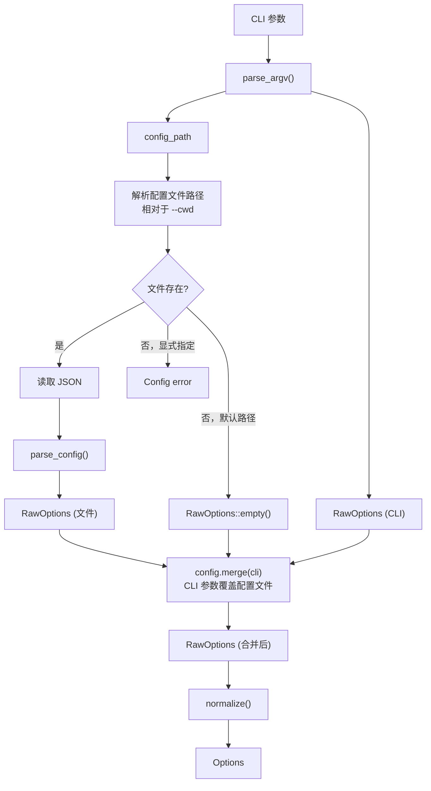

# 配置系统文档

本文档详细描述 `moon-bump` 的配置系统，包括配置源、优先级、字段定义和生命周期脚本。

## 1. 配置源与优先级

moon-bump 支持三层配置，按优先级从低到高排列：

```
默认值  <  bump.config.json  <  CLI 参数
```

| 配置源 | 说明 |
|--------|------|
| **默认值** | 在 `Options::default()` 中硬编码 |
| **bump.config.json** | JSON 配置文件（可选） |
| **CLI 参数** | 命令行参数（最高优先级） |

### 合并策略

配置合并使用 `RawOptions::merge(base, incoming)` 方法。对于每个字段，使用 `prefer` 辅助函数：

```moonbit
///|
fn[T] prefer(base : T?, incoming : T?) -> T? {
  match incoming {
    Some(value) => Some(value)
    None => base
  }
}
```

即 `incoming`（CLI 参数）的 `Some` 值覆盖 `base`（配置文件），`None` 保留 `base` 的值。

### 加载流程



## 2. bump.config.json 配置文件

### 文件位置

- **默认**：工作目录下的 `bump.config.json`
- **自定义**：通过 `--config path` 或 `--configFilePath path` 指定
- **路径解析**：相对路径基于 `--cwd`（默认为当前目录）

**文件存在性规则**：
- 默认配置文件不存在 → 静默使用空配置（不报错）
- 显式指定的配置文件不存在 → 报错退出

### 支持的字段

| JSON 字段 (camelCase) | MoonBit 字段 (snake_case) | 类型 | 默认值 | 说明 |
|---|---|---|---|---|
| `release` | `release` | `string` | `"prompt"` | 版本类型或精确版本号 |
| `preid` | `preid` | `string` | `"beta"` | 预发布标识符 |
| `commit` | `commit` | `bool \| string` | `true` | 提交设置 |
| `tag` | `tag` | `bool \| string` | `true` | 标签设置 |
| `sign` | `sign` | `bool` | `false` | GPG/SSH 签名 |
| `push` | `push` | `bool` | `true` | 推送到远程 |
| `update` | `update` | `bool` | `false` | 运行 `moon update` |
| `all` | `all` | `bool` | `false` | 暂存所有文件 |
| `noGitCheck` | `no_git_check` | `bool` | `false` | 跳过工作区检查 |
| `confirm` | `confirm` | `bool` | `true` | 需要用户确认 |
| `noVerify` | `no_verify` | `bool` | `false` | 跳过 Git hooks |
| `files` | `files` | `string[]` | `["moon.mod"]` | 要更新的文件列表 |
| `cwd` | `cwd` | `string` | `"."` | 工作目录 |
| `ignoreScripts` | `ignore_scripts` | `bool` | `false` | 忽略生命周期脚本 |
| `recursive` | `recursive` | `bool` | `false` | 递归查找 moon.mod |
| `printCommits` | `print_commits` | `bool` | `true` | 打印提交记录 |
| `quiet` | `quiet` | `bool` | `false` | 安静模式 |
| `currentVersion` | `current_version` | `string` | - | 覆盖当前版本号 |
| `execute` | `execute` | `string` | - | 自定义命令 |

### commit / tag 三态机制 (TemplateSetting)

`commit` 和 `tag` 字段支持三种值类型：

| JSON 值 | TemplateSetting | 规范化结果 | 效果 |
|---------|----------------|------------|------|
| `true` | `Enabled` | 使用默认模板 | commit: `"release: v%s"`；tag: `"v%s"` |
| `false` | `Disabled` | `None` | 跳过该操作 |
| `"自定义模板"` | `Template("自定义模板")` | 使用自定义模板 | 使用提供的模板 |
| 不设置 | `None`（缺省） | 使用默认模板 | 同 `true` |

**模板替换规则**：
- 如果模板包含 `%s`：替换所有 `%s` 为版本号
- 如果不包含 `%s`：将版本号追加到模板末尾

**示例**：

| 模板 | 版本号 | 结果 |
|------|--------|------|
| `"release: v%s"` | `"1.2.0"` | `"release: v1.2.0"` |
| `"chore(release): v%s (#%s)"` | `"1.2.0"` | `"chore(release): v1.2.0 (#1.2.0)"` |
| `"v"` | `"1.2.0"` | `"v1.2.0"` |

### 配置示例

**最小配置**（使用 Conventional Commits 自动推导版本）：

```json
{
  "release": "conventional"
}
```

**完整配置示例**：

```json
{
  "release": "conventional",
  "update": true,
  "commit": "release: v%s",
  "tag": "v%s",
  "files": ["moon.mod", "README.md"],
  "all": true,
  "printCommits": true
}
```

**禁用提交和标签**（仅更新文件）：

```json
{
  "commit": false,
  "tag": false,
  "push": false
}
```

## 3. CLI 参数与配置字段对照表

| CLI 参数 | 对应配置字段 | 特殊处理 |
|---|---|---|
| `[release]` (位置参数第一个) | `release` | 自动检测版本类型或版本号 |
| `[files...]` (位置参数其余) | `files` | 设置 `files_explicit = true` |
| `--release` | `release` | 覆盖位置参数 |
| `--preid` | `preid` | — |
| `--commit`, `-c` | `commit` → `Template(value)` | 与 `--no-commit` 互斥 |
| `--no-commit` | `commit` → `Disabled` | — |
| `--tag`, `-t` | `tag` → `Template(value)` | 与 `--no-tag` 互斥 |
| `--no-tag` | `tag` → `Disabled` | — |
| `--sign` | `sign` | — |
| `--push` / `--no-push` | `push` | negatable flag |
| `--update` / `--no-update` | `update` | negatable flag |
| `--all`, `-a` | `all` | — |
| `--git-check` / `--no-git-check` | `no_git_check` | **反转**：`--no-git-check` 设置 `no_git_check = true` |
| `--verify` / `--no-verify` | `no_verify` | **反转**：`--no-verify` 设置 `no_verify = true` |
| `--yes`, `-y` | `confirm` | **反转**：`--yes` 设置 `confirm = false` |
| `--recursive`, `-r` | `recursive` | `files` 显式指定时强制为 `false` |
| `--ignore-scripts` | `ignore_scripts` | — |
| `--quiet`, `-q` | `quiet` | — |
| `--print-commits` / `--no-print-commits` | `print_commits` | negatable flag |
| `--current-version` | `current_version` | 验证为有效 SemVer |
| `--execute`, `-x` | `execute` | — |
| `--cwd` | `cwd` | — |
| `--config`, `--configFilePath` | _(config_path)_ | 配置文件路径 |

### 反转标志说明

三个字段在 CLI 和内部模型之间存在逻辑反转：

| CLI 参数 | 内部字段 | CLI 含义 | 内部含义 |
|----------|----------|----------|----------|
| `--yes` | `confirm` | 跳过确认 → `true` | 需要确认 → `false` |
| `--no-git-check` | `no_git_check` | 跳过检查 → flag开启 | 跳过检查 → `true` |
| `--no-verify` | `no_verify` | 跳过验证 → flag开启 | 跳过验证 → `true` |

## 4. 生命周期脚本配置

生命周期脚本从主 `moon.mod` 文件的 `options(scripts: {...})` 块中读取：

```
options(
  scripts: {
    "preversion": "echo 'before version change'",
    "version": "moon build --release",
    "postversion": "echo 'release complete'",
  },
)
```

### 支持的脚本

| 脚本名 | 执行时机 | 典型用途 |
|--------|----------|----------|
| `preversion` | 文件更新前 | 运行测试、代码检查 |
| `version` | 文件更新后、Git 提交前 | 构建、生成文档 |
| `postversion` | Git 提交和标签后 | 发布通知、清理 |

### 执行顺序

```
preversion → 文件更新 → moon update → execute → version → commit → tag → postversion → push commit → push tag
```

### 配置选项

- `--ignore-scripts`：跳过所有生命周期脚本
- 如果未选择 `moon.mod` 文件，脚本为空
- 脚本通过跨平台 shell 执行（Windows: `cmd /c`，Unix: `sh -c`）

## 5. 规范化详情

`normalize(RawOptions) → Result[Options, AppError]` 的完整逻辑：

1. **release**：使用 `parse_release()` 将字符串转换为 `ReleaseSpec`
2. **current_version**：如果提供，验证为有效 SemVer
3. **commit 模板**：`normalize_template(raw.commit, "release: v%s")` → `String?` → `CommitOptions?`
4. **tag 模板**：`normalize_template(raw.tag, "v%s")` → `String?` → `TagOptions?`
5. **布尔字段**：全部通过 `unwrap_or(默认值)` 设置默认值
6. **files**：缺省时使用 `["moon.mod"]`
7. **files_explicit**：`raw.files is Some(_)` 时为 `true`
8. **recursive**：当 `files_explicit` 为 `true` 时，强制设为 `false`

---

> 📖 **更多信息**
> - 数据模型：[data-model.md](data-model.md)
> - 模块设计：[module-design.md](module-design.md)
> - 执行流程：[workflow.md](workflow.md)
