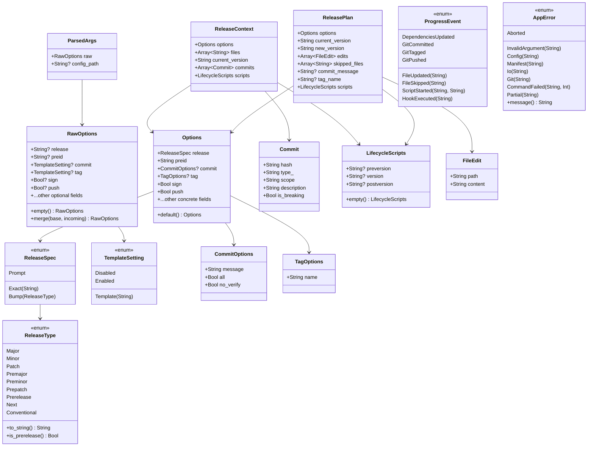
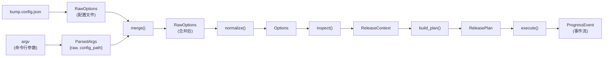

# 数据模型文档

本文档详细描述 `moon-bump` 中所有核心数据类型的定义、字段含义、关系和数据流转。

## 1. 类型关系图



## 2. 核心数据流



## 3. 详细类型文档

### ReleaseType — 版本发布类型

```moonbit
///|
pub(all) enum ReleaseType {
  Major; Minor; Patch
  Premajor; Preminor; Prepatch; Prerelease
  Next; Conventional
}
```

| 值 | 说明 | 示例（当前 1.2.3） | 示例（当前 1.2.3-beta.1） |
|---|---|---|---|
| `Major` | 主版本升级 | 2.0.0 | 2.0.0 |
| `Minor` | 次版本升级 | 1.3.0 | 1.3.0 |
| `Patch` | 修订版升级 | 1.2.4 | 1.2.4 |
| `Premajor` | 主版本预发布 | 2.0.0-beta.1 | 2.0.0-beta.1 |
| `Preminor` | 次版本预发布 | 1.3.0-beta.1 | 1.3.0-beta.1 |
| `Prepatch` | 修订版预发布 | 1.2.4-beta.1 | 1.2.4-beta.1 |
| `Prerelease` | 递增预发布号 | 1.2.4-beta.1 | 1.2.3-beta.2 |
| `Next` | 智能选择 | 1.2.4 (Patch) | 1.2.3-beta.2 (Prerelease) |
| `Conventional` | 基于提交推导 | 取决于提交 | 1.2.3-beta.2 (Prerelease) |

**方法**：
- `to_string()` — 返回小写名称（如 `"major"`）
- `is_prerelease()` — `Premajor`/`Preminor`/`Prepatch`/`Prerelease` 返回 `true`

### ReleaseSpec — 版本发布规格

```moonbit
///|
pub(all) enum ReleaseSpec {
  Prompt        // 交互式选择
  Exact(String) // 精确版本号（如 "2.0.0"）
  Bump(ReleaseType) // 基于类型计算
}
```

| 来源 | 示例 | 转换为 |
|------|------|--------|
| 默认值 | 无参数运行 | `Prompt` |
| CLI `--release patch` | `"patch"` | `Bump(Patch)` |
| CLI `moon-bump 2.0.0` | `"2.0.0"` | `Exact("2.0.0")` |
| 配置文件 `"release": "conventional"` | `"conventional"` | `Bump(Conventional)` |

### TemplateSetting — 模板三态

```moonbit
///|
pub(all) enum TemplateSetting {
  Disabled          // 禁用操作
  Enabled           // 使用默认模板
  Template(String)  // 使用自定义模板
}
```

**规范化流程**：

| TemplateSetting | 默认模板 | 规范化结果 |
|---|---|---|
| `None`（未指定） | `"release: v%s"` | `Some("release: v%s")` |
| `Enabled` | `"release: v%s"` | `Some("release: v%s")` |
| `Disabled` | - | `None` |
| `Template("chore: %s")` | - | `Some("chore: %s")` |

用于 `commit` 和 `tag` 字段，转换为 `CommitOptions?` / `TagOptions?`。

### CommitOptions — 提交选项

```moonbit
///|
pub(all) struct CommitOptions {
  message : String    // 提交消息模板
  all : Bool          // git commit --all
  no_verify : Bool    // --no-verify 跳过 hooks
}
```

### TagOptions — 标签选项

```moonbit
///|
pub(all) struct TagOptions {
  name : String  // 标签名模板
}
```

### Options — 规范化选项

```moonbit
///|
pub(all) struct Options {
  release : ReleaseSpec
  preid : String
  commit : CommitOptions?
  tag : TagOptions?
  sign : Bool
  push : Bool
  update : Bool
  all : Bool
  no_git_check : Bool
  confirm : Bool
  files : Array[String]
  files_explicit : Bool
  cwd : String
  ignore_scripts : Bool
  recursive : Bool
  print_commits : Bool
  quiet : Bool
  current_version : String?
  execute : String?
}
```

**完整默认值表**：

| 字段 | 默认值 | 说明 |
|------|--------|------|
| `release` | `Prompt` | 交互式选择 |
| `preid` | `"beta"` | 预发布标识符 |
| `commit` | `Some({message: "release: v%s", all: false, no_verify: false})` | 默认创建提交 |
| `tag` | `Some({name: "v%s"})` | 默认创建标签 |
| `sign` | `false` | 不签名 |
| `push` | `true` | 自动推送 |
| `update` | `false` | 不运行 moon update |
| `all` | `false` | 仅暂存修改的文件 |
| `no_git_check` | `false` | 检查工作区 |
| `confirm` | `true` | 需要确认 |
| `files` | `["moon.mod"]` | 默认更新 moon.mod |
| `files_explicit` | `false` | 文件未显式指定 |
| `cwd` | `"."` | 当前目录 |
| `ignore_scripts` | `false` | 执行生命周期脚本 |
| `recursive` | `false` | 不递归 |
| `print_commits` | `true` | 打印提交 |
| `quiet` | `false` | 输出进度 |
| `current_version` | `None` | 从 moon.mod 读取 |
| `execute` | `None` | 无自定义命令 |

### RawOptions — 原始选项

```moonbit
///|
pub(all) struct RawOptions {
  release : String?
  preid : String?
  commit : TemplateSetting?
  tag : TemplateSetting?
  sign : Bool?
  // ... 所有字段均为 Option 类型
}
```

所有字段都是 `Option` 类型（`T?`），表示"未指定"状态。

**方法**：
- `empty()` — 创建全部为 `None` 的实例
- `merge(base, incoming)` — 合并两组选项，`incoming` 中的 `Some` 值覆盖 `base`，`None` 保留 `base` 的值

### Commit — 提交记录

```moonbit
///|
pub(all) struct Commit {
  hash : String        // 完整 commit hash
  type_ : String       // 提交类型（feat, fix, chore 等）
  scope : String       // 作用域（可为空）
  description : String // 提交描述
  is_breaking : Bool   // 是否为破坏性变更
}
```

**解析规则**（Conventional Commits）：
- 格式：`type(scope)!: description`
- `!` 或 `BREAKING CHANGE:` footer 标记为 breaking
- 无法解析的提交：`type_` 和 `scope` 为空字符串

### LifecycleScripts — 生命周期脚本

```moonbit
///|
pub(all) struct LifecycleScripts {
  preversion : String?   // 版本更新前脚本
  version : String?      // 版本更新后脚本
  postversion : String?  // 发布完成后脚本
}
```

从 `moon.mod` 的 `options(scripts: { ... })` 块中读取。

### FileEdit — 文件编辑

```moonbit
///|
pub(all) struct FileEdit {
  path : String     // 文件相对路径
  content : String  // 更新后的完整文件内容
}
```

### ReleaseContext — 发布上下文

```moonbit
///|
pub(all) struct ReleaseContext {
  options : Options              // 规范化的选项
  files : Array[String]          // 发现的文件列表
  current_version : String       // 当前版本号
  commits : Array[Commit]        // 上个标签以来的提交
  scripts : LifecycleScripts     // 生命周期脚本
}
```

由 `inspect()` 产生，持有做版本决策所需的所有信息。

### ReleasePlan — 发布计划

```moonbit
///|
pub(all) struct ReleasePlan {
  options : Options              // 规范化的选项
  current_version : String       // 当前版本号
  new_version : String           // 新版本号
  edits : Array[FileEdit]        // 要应用的文件编辑
  skipped_files : Array[String]  // 无需修改的文件
  commit_message : String?       // 格式化的提交消息（None 表示不提交）
  tag_name : String?             // 格式化的标签名（None 表示不打标签）
  scripts : LifecycleScripts     // 生命周期脚本
}

///|
pub fn ReleasePlan::is_noop(self : ReleasePlan) -> Bool {
  self.new_version == self.current_version && self.edits.length() == 0
}
```

由 `build_plan()` 产生，是 `execute()` 的输入。提供 `is_noop()` 方法判断发布计划是否无需做任何变更。

### ProgressEvent — 进度事件

```moonbit
///|
pub(all) enum ProgressEvent {
  FileUpdated(String)              // 文件已更新（路径）
  FileSkipped(String)              // 文件已跳过（路径）
  ScriptStarted(String, String)    // 脚本开始（名称, 命令）
  DependenciesUpdated              // moon update 完成
  HookExecuted(String)             // execute 命令完成（命令）
  GitCommitted                     // 提交已创建
  GitTagged                        // 标签已创建
  GitPushed                        // 推送完成
}
```

在 `execute()` 阶段通过 `emit` 回调发出，由 CLI 层的 `report_progress` 转换为用户可见的输出。

### AppError — 应用错误

```moonbit
///|
pub(all) enum AppError {
  InvalidArgument(String)      // 无效参数
  Config(String)               // 配置错误
  Manifest(String)             // 清单文件错误
  Io(String)                   // I/O 错误
  Git(String)                  // Git 操作错误
  CommandFailed(String, Int)   // 命令执行失败（命令, 退出码）
  Partial(String)              // 部分完成（含已完成步骤信息）
  Aborted                      // 用户取消
}
```

详见 [error-handling.md](error-handling.md)。

### ParsedArgs — 解析结果

```moonbit
///|
pub(all) struct ParsedArgs {
  raw : RawOptions     // 解析出的原始选项
  config_path : String? // 显式指定的配置文件路径
}
```

由 CLI 参数解析产生，作为配置加载的输入。

---

> 📖 **更多信息**
> - 模块设计：[module-design.md](module-design.md)
> - 配置系统：[configuration.md](configuration.md)
> - 错误处理：[error-handling.md](error-handling.md)
