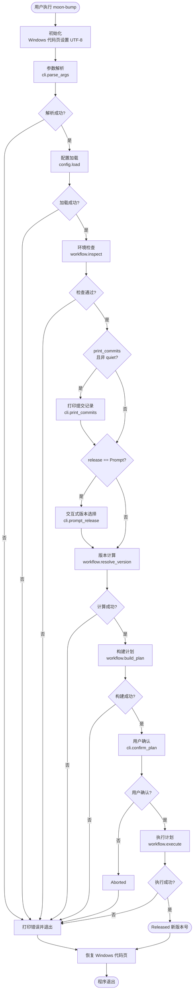
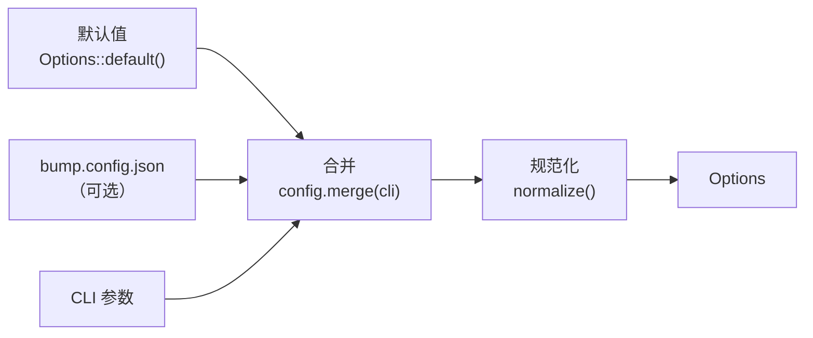
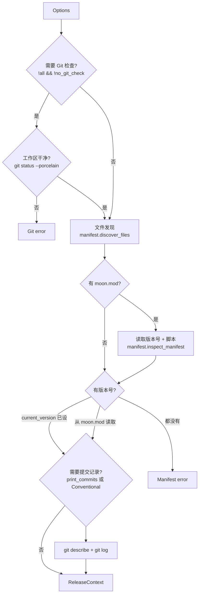
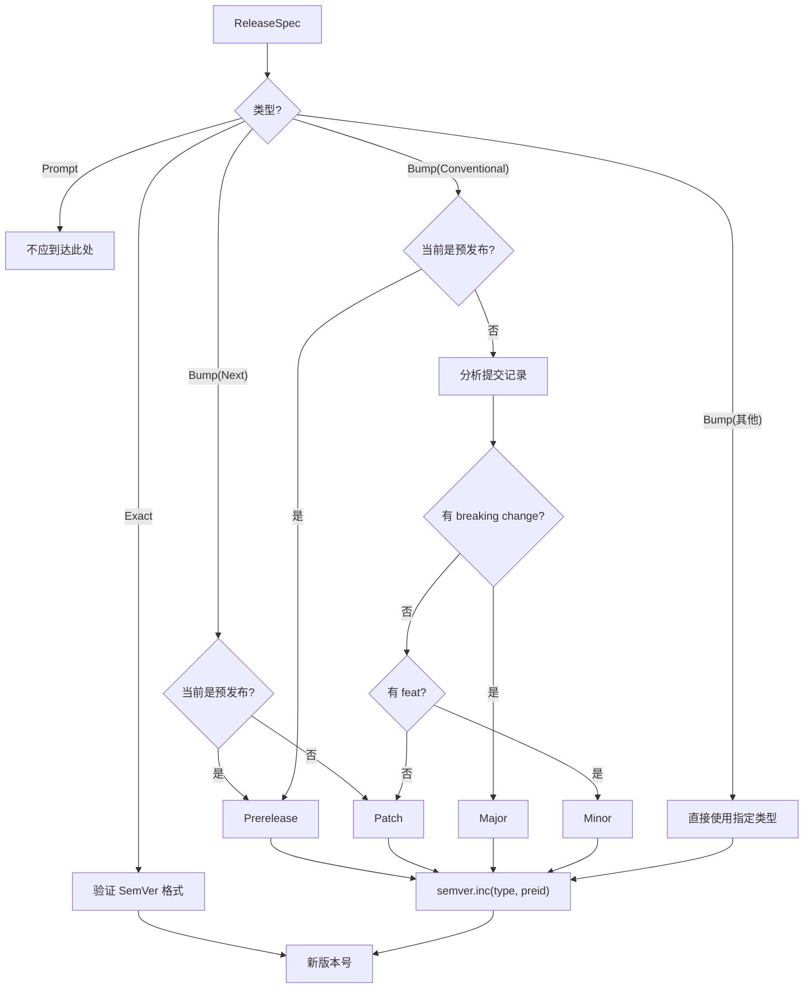
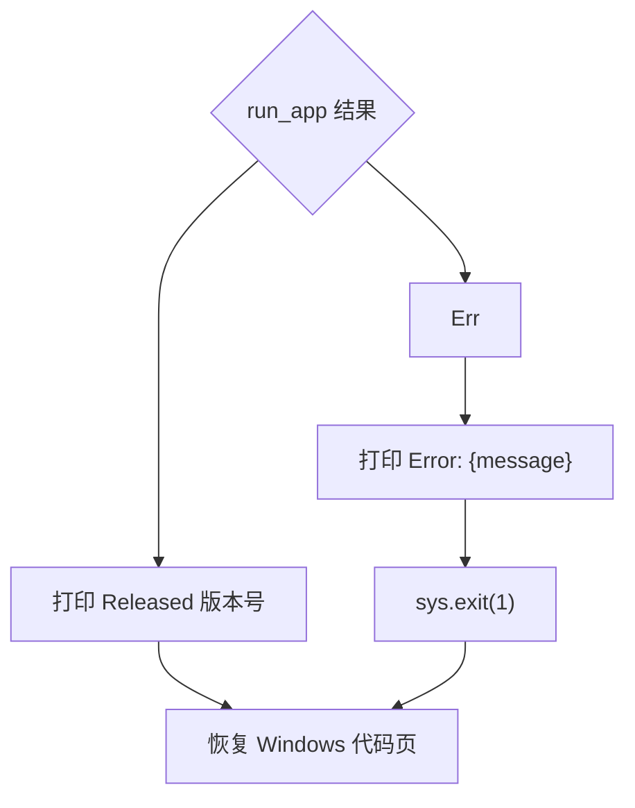

# 执行流程文档

本文档详细描述了 `moon-bump` 的完整执行流程，从用户运行命令到发布完成的每一步。

## 1. 流程概览

moon-bump 的执行分为 9 个主要阶段：

| # | 阶段 | 入口函数 | 说明 |
|---|------|----------|------|
| 1 | 初始化 | `main` | Windows 代码页设置 |
| 2 | 参数解析 | `@cli.parse_args()` | 解析命令行参数 |
| 3 | 配置加载 | `@config.load()` | 合并配置文件与 CLI 参数 |
| 4 | 环境检查 | `@workflow.inspect()` | Git 状态、文件发现、版本获取 |
| 5 | 版本选择 | `@cli.prompt_release()` | 交互式版本选择（如需要） |
| 6 | 版本计算 | `@workflow.resolve_version()` | 计算新版本号 |
| 7 | 计划构建 | `@workflow.build_plan()` | 构建文件编辑和 Git 操作计划 |
| 8 | 用户确认 | `@cli.confirm_plan()` | 展示摘要并确认 |
| 9 | 计划执行 | `@workflow.execute()` | 执行所有文件和 Git 操作 |

## 2. 完整执行流程图



## 3. 阶段详解

### 3.1 初始化阶段

```moonbit
///|
async fn main {
  let mut old_cp = 0U
  match @env.get_env_var("OS") {
    Some(os) => if os == "Windows_NT" {
      old_cp = @platform.get_console_output_cp()
      @platform.set_console_output_cp(65001U)
    }
    None => ()
  }
  // ... 运行应用 ...
  if old_cp != 0U {
    @platform.set_console_output_cp(old_cp)
  }
}
```

- 检测 `OS` 环境变量判断是否为 Windows
- 设置控制台输出代码页为 UTF-8 (65001)，确保 emoji 和 Unicode 正确显示
- 保存旧代码页，程序退出时恢复（即使发生错误）

### 3.2 参数解析阶段

`@cli.parse_args()` 读取进程参数（跳过程序名），通过 `@argparse` 解析为 `ParsedArgs`：

**解析规则**：
1. 定义 12 个 flag 参数（如 `--all`、`--push`、`--no-commit`）
2. 定义 8 个 option 参数（如 `--preid`、`--commit`、`--execute`）
3. 定义 1 个位置参数 `files`（支持 0~9999 个值）
4. 第一个位置参数如果是有效的版本类型（如 `patch`）或版本号（如 `1.2.3`），自动识别为 `release`
5. 特殊反转：`--yes` → `confirm=false`，`--no-git-check` → `no_git_check=true`

**输出**：`ParsedArgs { raw: RawOptions, config_path: String? }`

### 3.3 配置加载阶段

`@config.load(raw, config_path)` 实现三层配置合并：



1. 确定配置文件路径（默认 `bump.config.json`）
2. 读取并解析 JSON（默认不存在时静默跳过，显式指定不存在时报错）
3. `config.merge(cli)` — CLI 参数的 `Some` 值覆盖配置文件
4. `normalize()` — 解析版本类型、验证 SemVer、解析模板、设置默认值

### 3.4 环境检查阶段（inspect）

`@workflow.inspect(options)` 收集执行所需的完整上下文：



### 3.5 版本选择阶段

当 `release == Prompt` 时，进入全屏 TUI 交互式选择：

```
? Current version 0.1.0 »
> patch        0.1.1
  minor        0.2.0
  major        1.0.0
  next         0.1.1
  conventional 0.1.1
  prerelease   0.1.1-beta.1
  pre-patch    0.1.1-beta.1
  pre-minor    0.2.0-beta.1
  pre-major    1.0.0-beta.1
  as-is        0.1.0
  custom ...
```

用户可以：
- 使用方向键（`Up`/`Down`）移动光标
- 按 `Enter` 确认选择
- 选择 `custom ...` 进入自定义版本号输入模式（支持字符输入与退格）
- 按 `Ctrl+C` 取消退出（返回 `Err(Aborted)`）
- 默认高亮第一项（直接回车即可快速升级）

### 3.6 版本计算阶段

`@workflow.resolve_version(context, release)` 根据 `ReleaseSpec` 计算新版本号：



### 3.7 计划构建阶段（build_plan）

`@workflow.build_plan(context, new_version)` 构建完整的发布计划：

1. 遍历所有目标文件：
   - **moon.mod**：使用 TOML tokenizer 精确替换 `version` 值
   - **其他文件**：使用边界感知的文本替换
   - 如果内容未变化：添加到 `skipped_files`
   - 如果内容变化：创建 `FileEdit` 添加到 `edits`
2. 格式化提交消息：`"release: v%s"` → `"release: v0.2.0"`
3. 格式化标签名称：`"v%s"` → `"v0.2.0"`

### 3.8 用户确认阶段

如果 `plan.is_noop()` 为 true（版本未改变且无编辑），输出提示并不做任何操作：

```
Version unchanged at 0.1.0; nothing to do
```

如果版本有变动且 `confirm == true`（默认），展示发布摘要并等待用户确认：

```
Release 0.1.0 -> 0.2.0
  files: moon.mod
  commit: release: v0.2.0
  tag: v0.2.0
  push: yes
? Continue? (Y/n) 
```

- 启用 Raw Mode 单键监听，按 `y`、`Y`、`Enter` 为确认
- 按 `n`、`N` 或 `Ctrl+C` 视为取消，返回 `Err(Aborted)`

如果 `confirm == false`（`--yes`），跳过确认直接执行。

### 3.9 执行阶段（execute）

这是最关键的阶段，按严格顺序执行不可逆操作（若 `plan.is_noop()` 则直接返回 `Ok(())`）：

```mermaid
flowchart TD
    START([开始执行]) --> NOOP_CHECK{plan.is_noop()?}
    NOOP_CHECK -- 是 --> DONE([直接返回])
    NOOP_CHECK -- 否 --> PRE[1. preversion 脚本]
    PRE --> FILES[2. 写入文件编辑]
    FILES --> UPDATE{3. update 启用?}
    UPDATE -- 是 --> MOON_UPDATE[moon update]
    UPDATE -- 否 --> EXEC_CHECK
    MOON_UPDATE --> EXEC_CHECK

    EXEC_CHECK{4. execute 命令?}
    EXEC_CHECK -- 是 --> EXEC_CMD[执行自定义命令]
    EXEC_CHECK -- 否 --> VER
    EXEC_CMD --> VER

    VER[5. version 脚本] --> COMMIT_CHECK{6. 需要提交?}
    COMMIT_CHECK -- 是 --> GIT_ADD[git add]
    COMMIT_CHECK -- 否 --> TAG_CHECK
    GIT_ADD --> GIT_COMMIT[git commit]
    GIT_COMMIT --> TAG_CHECK

    TAG_CHECK{7. 需要标签?}
    TAG_CHECK -- 是 --> GIT_TAG[git tag]
    TAG_CHECK -- 否 --> POST
    GIT_TAG --> POST

    POST[8. postversion 脚本] --> PUSH_CHECK{9. 需要推送?}
    PUSH_CHECK -- 是 --> PUSH_COMMIT[git push]
    PUSH_CHECK -- 否 --> DONE
    PUSH_COMMIT --> PUSH_TAGS[git push target tag]
    PUSH_TAGS --> DONE([执行完成])
```

**每个步骤的详细说明**：

| 步骤 | 操作 | 条件 | 进度事件 |
|------|------|------|----------|
| 1 | preversion 脚本 | `scripts.preversion` 存在 | `ScriptStarted` |
| 2 | 写入文件 | 对每个 `FileEdit` | `FileUpdated` / `FileSkipped` |
| 3 | `moon update` | `options.update == true` | `DependenciesUpdated` |
| 4 | execute 命令 | `options.execute` 存在 | `HookExecuted` |
| 5 | version 脚本 | `scripts.version` 存在 | `ScriptStarted` |
| 6 | git add + commit | `options.commit` 存在 | `GitCommitted` |
| 7 | git tag | `options.tag` 存在 | `GitTagged` |
| 8 | postversion 脚本 | `scripts.postversion` 存在 | `ScriptStarted` |
| 9 | git push + push tag | `options.push == true` | `GitPushed` |

**推送标签说明**：
不同于通配全量推送，`git push tag` 会先解析远程（优先检查 `remote.pushDefault`，再解析当前上游分支的 remote，保底使用 `origin`），然后精确推送该版本的特定 ref：`git push <remote> refs/tags/<name>:refs/tags/<name>`。

**部分失败处理**：

每一步成功后追加到 `completed` 数组。任何步骤失败时，错误消息包含已完成步骤列表：

```
Release partially completed: failed during git push; completed local steps: preversion, updated moon.mod, git add, git commit, git tag; cause: Git error: ...
```

## 4. 错误处理流程



- 所有错误通过 `Result[T, AppError]` 冒泡至顶层
- 顶层捕获后打印错误消息并以退出码 1 退出
- Windows 代码页始终恢复（无论成功或失败）
- `Partial` 错误包含已完成步骤，帮助用户手动恢复

---

> 📖 **更多信息**
> - 系统架构：[architecture.md](architecture.md)
> - 模块设计：[module-design.md](module-design.md)
> - 数据模型：[data-model.md](data-model.md)
> - 错误处理：[error-handling.md](error-handling.md)
